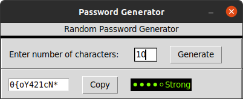
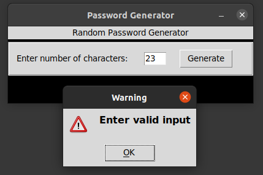
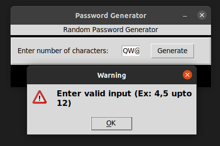

# Password Generator Using Pythonand Tkinter

## 1) It generates random password based user requirement

#### It also shows the rating of password strength with colors and you can copy text with copy button

## 2) It Shows warning message box when users enter out of range 

#### Range (4 to 12) including

## 2) It Shows warning message box when users enter string or other characters 

#### Input must be in int
